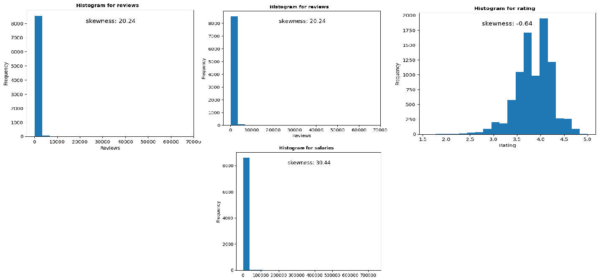
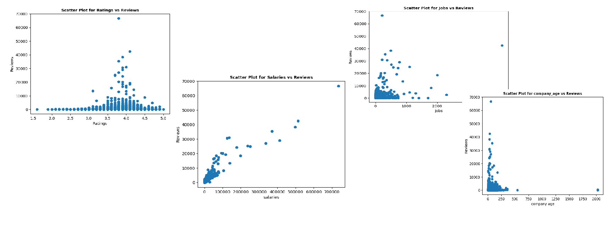
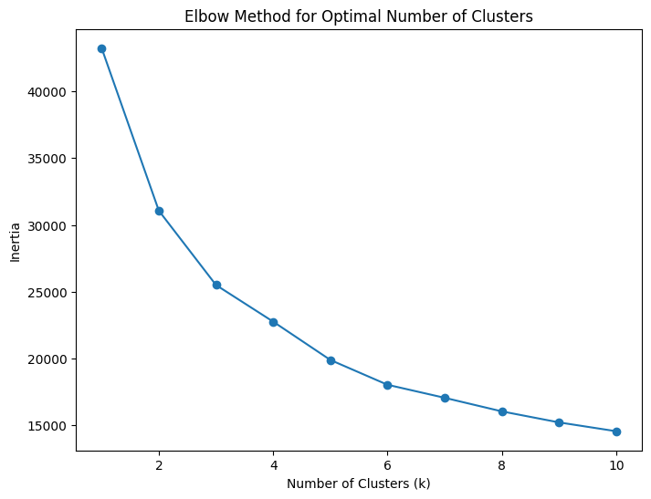
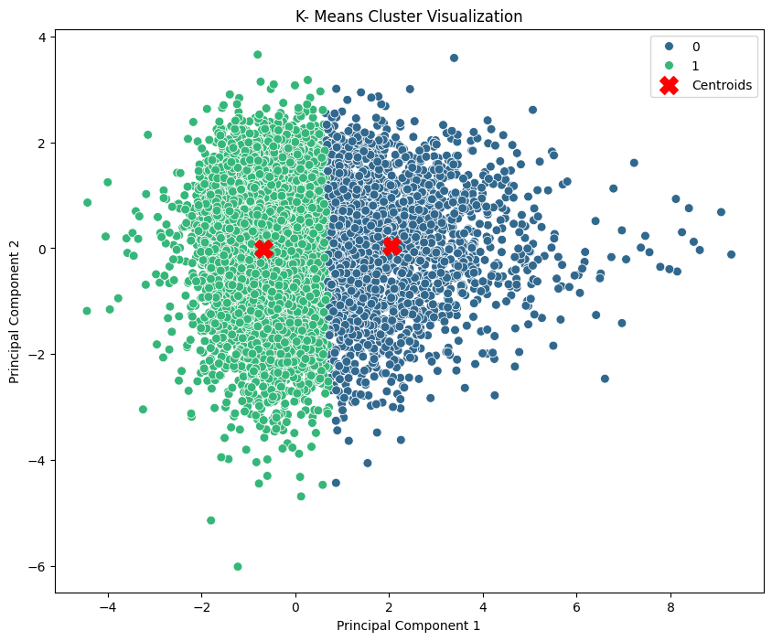
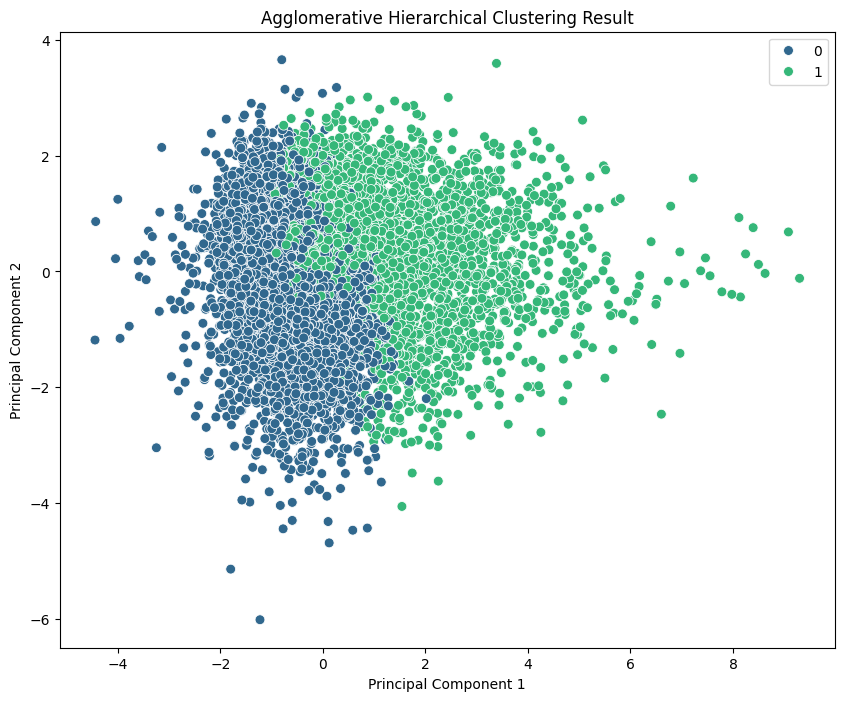

# Cluster Analysis on Indian Companies

Segmented Indian companies based on key attributes using PCA and clustering techniques like K-Means and Agglomerative Clustering. The analysis identified distinct groups, providing insights into company characteristics and market segmentation.

## Table of Contents
1. [Project Overview](#project-overview)
2. [Data Collection](#data-collection)
3. [Features](#features)
4. [Methodology](#methodology)
5. [Requirements](#requirements)
6. [Installation](#installation)
7. [Usage](#usage)
8. [Results](#results)
9. [Contributions](#contributions)
10. [License](#license)
---------------------
## Project Overview
This project segments Indian companies based on ratings, reviews, jobs, salaries, and company age. By applying PCA, the data was reduced to two principal components for easier visualization, and clustering techniques like K-Means and Agglomerative Clustering identified two groups of companies:

1. Growing firms with higher reviews, jobs, and salaries.
2. Established firms with higher ratings and older ages.

The results provide insights into market segmentation, aiding strategic decision-making.

---------------------------
## Data Collection
The data for this project was collected from [**AmbitionBox**](https://www.ambitionbox.com/), a platform offering detailed insights into companies, including ratings, reviews, salaries, and job openings. Using **Beautiful Soup**, a Python library for web scraping, key company attributes were extracted to form the dataset.

------------------------
## Features 

1. Name: Name of the company.
2. rating: Rating of the company.
3. company_type: The type of service provided by the company.
4. Employee_count: Number of employees in the company.
5. ownership_status: Ownership_status of the company, which would be private or public.
6. company_age: Age of the company.
7. head_quarters: Location of company headquarter.
8. reviews: The number of reviews about the company.
9. Salaries: The number of entries talking about the salary the company offers.
10. Interviews: The number of interviews conducted by the company.
11. Jobs: The number of job openings or positions in the company.
12. Benefits: Number of entries discussing the company's benefits.

--------------------

## Methodology

The project follows these main steps:

1. **Web Scraping**:
   - Data was collected by scraping car listing information from [AmbitionBox](https://www.ambitionbox.com/) using BeautifulSoup.

2. **Data Preprocessing**:
   - Cleaning the data and handling missing values.
   - Preparing the dataset for analysis by scaling numerical features and selecting relevant features.

3. **Exploratory Data Analysis (EDA)**:
   - Conducted univariate analysis on key attributes, including company_age, reviews, rating, salaries, interviews, jobs, and benefits, to understand their 
     distributions and identify patterns or anomalies in the dataset.
   - Performed bivariate analysis on numeric columns to explore relationships and correlations.

4. **Data Encoding**:
   - Transformed data as needed, including encoding and scaling, to improve model performance.

5. **Outlier Detection**:
   - Identified outliers using the Interquartile Range (IQR) and box plot methods.

6. **Outlier Treatment**:
   - Applied trimming, quantile-based flooring & capping and log transformation to handle outliers and normalize the data distribution.
  
7. **Cluster Analysis**:
   - Applied Cluster Analysis using:
     - **K Means Clustering**
     - **Agglomerative Clustering**

-----------------------------

## Requirements

- Python 3.x
Install all dependencies using:

```bash
pip install -r requirements.txt
```
-------------------------

## Installation 

To set up the project on your local machine, follow these steps:

**Clone the Repository**:

```bash
git clone https://github.com/tasneem-badar/Cluster-Analysis-on-Indian-companies.git
cd cluster Analysis on India Comapnies
```
---------------------------

## Usage

Open and execute the Jupyter Notebook 'Cluster Analysis on Indian Companies.ipynb' to explore clustering results and company segmentation. The notebook provides insights into company characteristics, feature distributions, and patterns across different clusters.

---------------------

## Results 

### Results of EDA- Univariate Analysis:

<p align="center">
  
</p>

<p align="center">
  <b>Univariate Analysis</b>
</p>

- Attributes like `reviews` and `salaries` exhibit strong right-skewness, with most companies having low values and a few having exceptionally high counts. 
- The `rating` attribute displays a more balanced distribution, centred around 4, with minimal skewness (-0.64).  
- These skewed distributions indicate potential outliers and uneven data spread across companies.  

### Results of EDA- Bivariate Analysis
<p align="center">
  
</p>

<p align="center">
  <b>Bivariate Analysis</b>
</p>

- **Ratings vs. Reviews:** Higher-rated companies generally tend to have fewer reviews, with most clustering around a rating of 4.  
- **Salaries vs. Reviews:** A positive correlation is evident, where companies offering higher salaries attract more reviews.  
- **Jobs vs. Reviews and Company Age vs. Reviews:** Companies with more job openings and older company ages exhibit varying review counts. However, most companies have fewer reviews regardless of these factors.

### **Results of PCA and Elbow Method**

The **Principal Component Analysis (PCA)** was applied to the dataset consisting of `rating`, `reviews`, `jobs`, `salaries`, and `company_age`. PCA reduced the dimensionality to two principal components, retaining most of the variance and simplifying visualization and clustering.

The **Elbow Method** was utilized to determine the optimal number of clusters by analyzing the within-cluster sum of squares (WCSS). The method identified **two optimal clusters**, which effectively group companies based on their attributes:
- **Cluster 0:** Higher values for `reviews`, `jobs`, and `salaries`, indicating companies with better employee-related metrics.
- **Cluster 1:** Higher values for `rating` and `company_age`, representing older and more established companies.

<p align="center">
  
</p>

These results provide a meaningful dataset segmentation, enabling further insights into company characteristics and performance.

### **Results of K- MEANS clustering**

The **K-Means Clustering** algorithm was applied to segment companies into two distinct clusters based on the principal components derived from the dataset. The clustering revealed the following insights:

- **Cluster 0 (Green):**
  - Companies in this cluster tend to have **higher values for `reviews`, `jobs`, and `salaries`**.
  - These companies are likely **employee-focused** with better opportunities and compensation but may not have as high `ratings` as the other cluster.
  - Represents younger or growing firms prioritizing employee satisfaction.

- **Cluster 1 (Blue):**
  - This cluster consists of companies with **higher values for `ratings` and `company_age`**.
  - These are likely **older, more established firms** with stable customer satisfaction metrics but relatively fewer job openings and reviews.
  - Indicates companies focused on maintaining long-term customer relationships.

<p align="center">
  
</p>

The **red markers** in the plot indicate the two clusters' centroids, representing the companies' average position in each group. These findings provide actionable insights into market segmentation, highlighting differences in company focus—whether on employees or customers—and aiding in strategic decision-making.

### **Results of Agglomerative Clustering**

The **Agglomerative Hierarchical Clustering** algorithm was applied to segment companies into two distinct clusters based on the principal components derived from the dataset. The results are visualized in the plot below, showcasing a clear separation between the clusters:

- **Cluster 0 (Blue):**
  - Represents companies with higher values for `ratings` and `company_age`, likely older and more established firms.
  - These companies exhibit stability and focus on customer satisfaction, with fewer reviews and job openings.

- **Cluster 1 (Green):**
  - Includes companies with higher values for `reviews`, `jobs`, and `salaries`, focusing on employee-centric metrics.
  - Likely to represent younger and growing firms with significant engagement from employees.

<p align="center">
  
</p>

The hierarchical nature of this algorithm enables a deeper understanding of how companies group based on their similarities. The clustering provides valuable insights into company characteristics, helping stakeholders identify trends and develop tailored strategies for different market segments.

### **Summary of Clustering Results**

The clustering analyses using **K-Means** and **Agglomerative Clustering** identified two distinct groups of companies, providing meaningful insights into their characteristics:

- **Cluster 0 (Blue):**
  - Represents older, established companies with higher `ratings` and `company_age`.
  - Focuses on stability and customer satisfaction, with fewer reviews and job openings.

- **Cluster 1 (Green):**
  - Represents younger, growing companies with higher values for `reviews`, `jobs`, and `salaries`.
  - Prioritizes employee engagement and growth opportunities.

Both clustering techniques revealed consistent segmentation and a clear understanding of company profiles.

---------------------
## Contributions

Contributions are welcome! Please feel free to open issues or submit pull requests for improvements.

----------------------
## License 
This project is licensed under the MIT License - see the [LICENSE](LICENSE) file for details.
  


